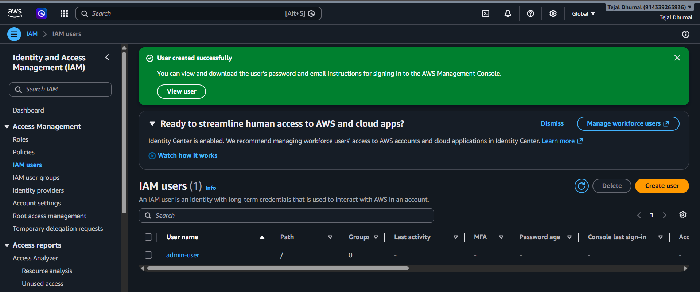
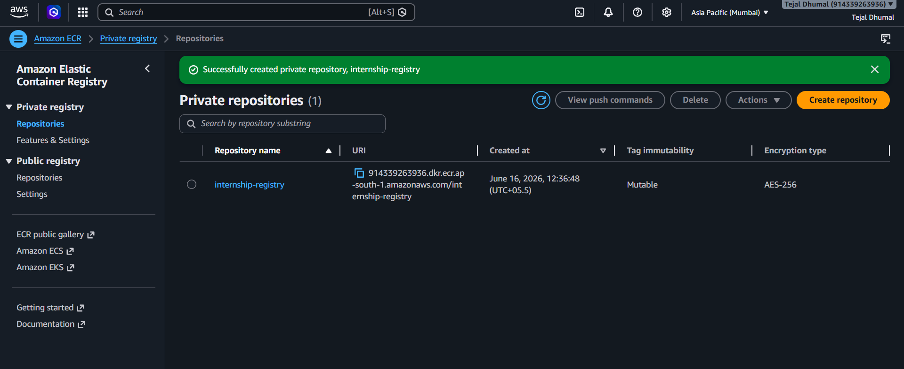
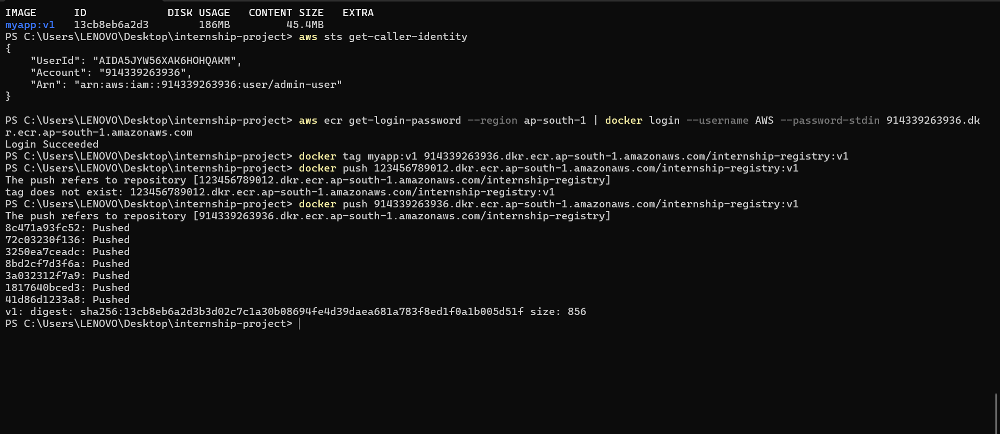
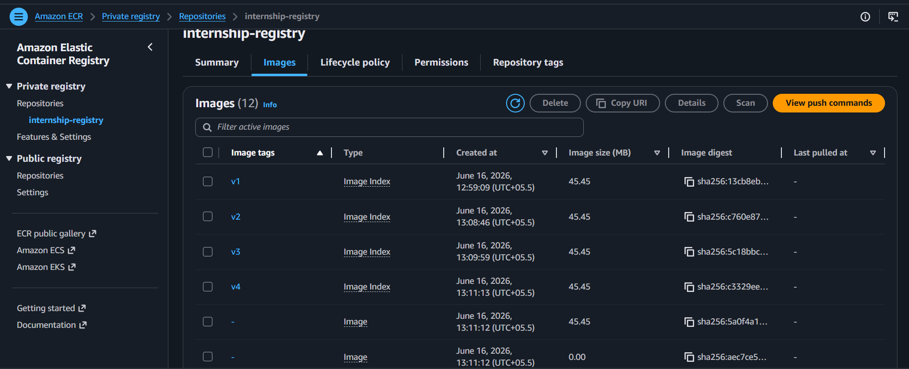
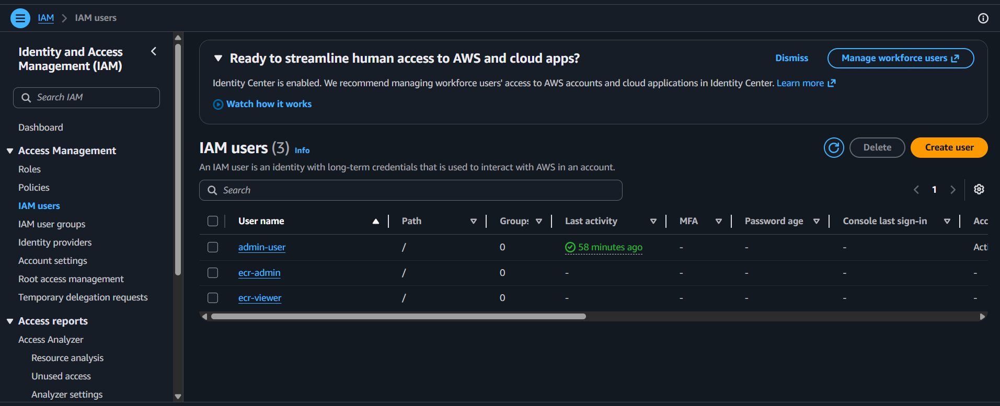
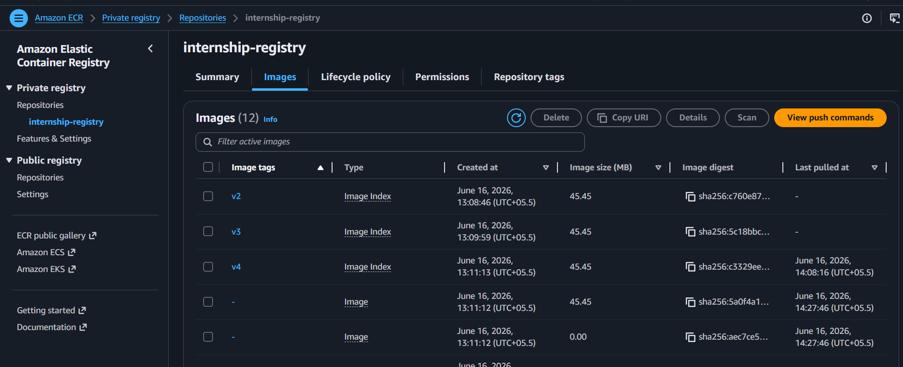
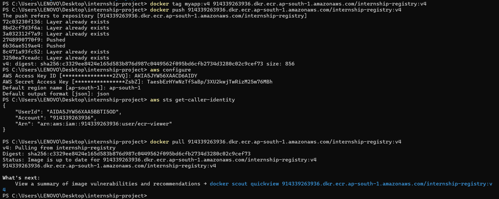
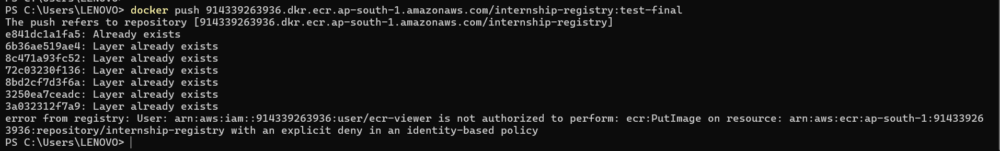

# Secure Private Container Registry with Image Lifecycle and Retention Policies

## Project Overview

This project implements a secure private container registry using Amazon Elastic Container Registry (ECR). It focuses on secure Docker image storage, IAM-based access control, image versioning, repository-level security policies, and automated lifecycle management for efficient image retention.

The project simulates a real-world DevOps use case where organizations need secure container image storage, controlled access, and automated cleanup to reduce cost and improve governance.

---

## Problem Statement

Organizations using unmanaged or public container registries face:

- Unauthorized access risks to container images
- Lack of proper image version control
- Increased storage costs due to unused images
- No automated image cleanup mechanism

This project addresses these challenges by implementing a secure, private, and policy-driven container registry.

---

## Objectives

- Create a private container registry using Amazon ECR
- Implement IAM-based access control for security
- Build and push multiple Docker image versions
- Apply repository-level access policies
- Configure lifecycle policies for automated image cleanup
- Retain only the latest 3 image versions
- Validate security through access control testing

---

## Technologies Used

- Docker
- Amazon Elastic Container Registry (ECR)
- AWS Identity and Access Management (IAM)
- AWS CLI
- PowerShell
- Python

---

## Architecture Overview

The solution consists of the following components:

### Container Registry Layer
Amazon ECR private repository used for secure storage of Docker images.

### Identity and Access Management Layer
AWS IAM used to control access:
- Admin users for push and management operations
- Viewer users for read-only access

### Lifecycle Management Layer
Automated lifecycle policy configured to:
- Retain only the latest 3 images
- Remove older images automatically
- Optimize storage usage

---

## Implementation Steps

### Step 1: Install Prerequisites

Install Docker and verify installation:

```bash
docker --version 
```
Install AWS CLI and verify:
```
aws --version
```
---

Step 2: Configure AWS CLI
```
aws configure
```

  Provide:

- AWS Access Key ID
- AWS Secret Access Key
- Region: ap-south-1
- Output format: json

Verify configuration:
```
aws sts get-caller-identity
```
---

Step 3: Create IAM User

Create an IAM user with the following configuration:

- Username: admin-user
- Policy: AdministratorAccess

Generate access keys and configure AWS CLI.


---

Step 4: Create Private ECR Repository

Create an Amazon ECR repository:

- Repository name: internship-registry
- Type: Private
- Enable scan on push



---

Step 5: Create Application

Create a simple Python application.
```
print("Version 1")
```
---

Step 6: Create Dockerfile

dockerfile
```
FROM python:3.11-slim

WORKDIR /app

COPY app.py .

CMD ["python", "app.py"]
```

---
Step 7: Build Docker Image
```
docker build -t myapp:v1 .
```
Verify images:
```
docker images
```

---
Step 8: Authenticate Docker with ECR
```
aws ecr get-login-password --region ap-south-1 \
| docker login --username AWS --password-stdin <account-id>.dkr.ecr.ap-south-1.amazonaws.com
```

---
Step 9: Tag Docker Image
```
docker tag myapp:v1 <account-id>.dkr.ecr.ap-south-1.amazonaws.com/internship-registry:v1
```
---
Step 10: Push Docker Image
```
docker push <account-id>.dkr.ecr.ap-south-1.amazonaws.com/internship-registry:v1
```


---
Step 11: Image Versioning

Update application for multiple versions:
```
print("Version 1")
print("Version 2")
print("Version 3")
print("Version 4")
```
For each version:

- Build image
- Tag image
- Push image

Tags used:

- v1
- v2
- v3
- v4



---
Step 12: IAM Access Control

Two IAM users are created:

- ecr-admin: Full access to ECR
- ecr-viewer: Read-only access

This ensures separation of duties and controlled access.




---
Step 13: Repository Policy
```
{
  "Version": "2012-10-17",
  "Statement": [
    {
      "Sid": "AllowPullAccess",
      "Effect": "Allow",
      "Principal": {
        "AWS": "arn:aws:iam::<account-id>:user/ecr-viewer"
      },
      "Action": [
        "ecr:BatchGetImage",
        "ecr:GetDownloadUrlForLayer"
      ]
    }
  ]
}
```

---
Step 14: Lifecycle Policy
```
{
  "rules": [
    {
      "rulePriority": 1,
      "description": "Retain only latest 3 images",
      "selection": {
        "tagStatus": "tagged",
        "tagPrefixList": ["v"],
        "countType": "imageCountMoreThan",
        "countNumber": 3
      },
      "action": {
        "type": "expire"
      }
    }
  ]
}
```
 


---
Step 15: Security Validation

Verify access control:

Allowed operation:
```
docker pull <account-id>.dkr.ecr.ap-south-1.amazonaws.com/internship-registry:v7
```



Denied operation:
```
docker push <repository>:test
```
This confirms IAM and repository policies are enforced correctly.


---
Key Learnings
- AWS ECR private registry setup and management
- Docker image versioning strategy
- IAM-based access control implementation
- Repository-level security policies
- Lifecycle policies for automated cleanup
- Secure and scalable DevOps practices